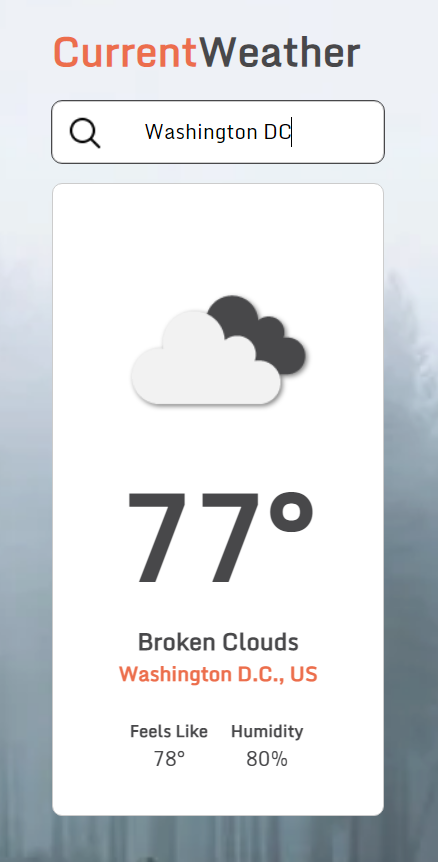

# CurrentWeather
A weather app which utilizes the [OpenWeatherMap](https://openweathermap.org/api) api. It displays the weather of the city the user enters. 

Toggle the temperature from Fehrenheit to Celsius with a simple click and also go to the location via [Google Maps](https://www.google.com/maps).

## Screenshot

## URL
https://omerome83.github.io/CurrentWeather
