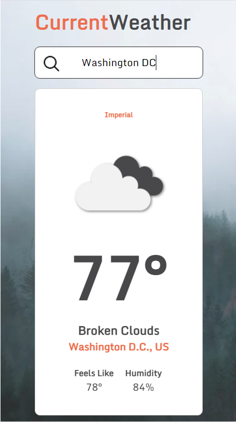

# CurrentWeather
A weather app which utilizes the [OpenWeatherMap](https://openweathermap.org/api) api. It displays the weather of the city the user enters. 

Toggle the temperature from Fehrenheit (Imperial) to Celsius (Metric) with a simple click. You can also view the location on [Google Maps](https://www.google.com/maps).

## Screenshot

## URL
https://omerome83.github.io/CurrentWeather
